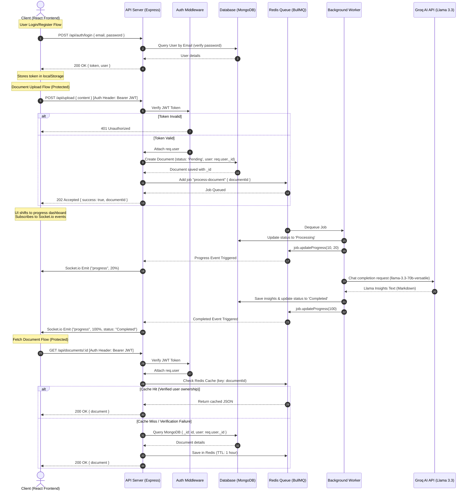
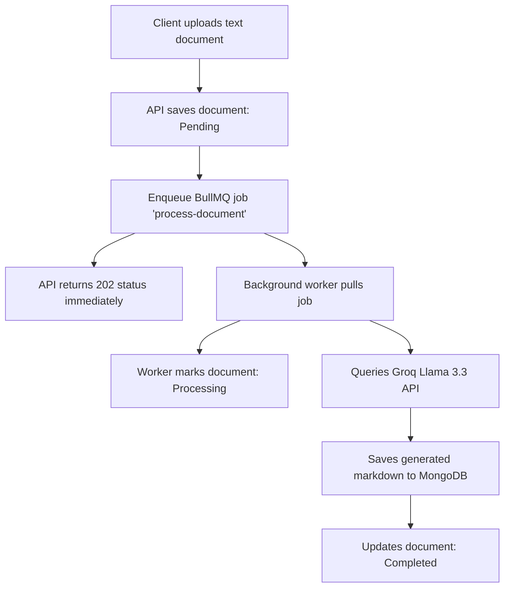
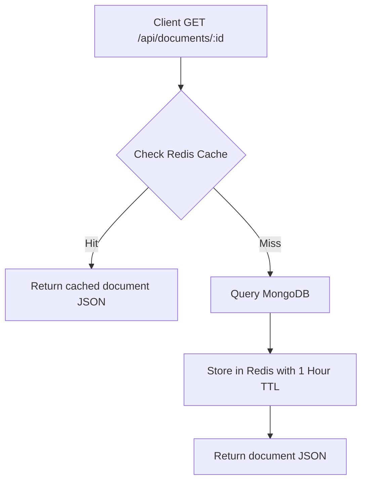

# InsightStream — AI-Powered Asynchronous Document Analysis Platform

> **Not just a summary.** InsightStream is an asynchronous document analysis platform designed to digest, queue, and extract deep insights from uploaded files using state-of-the-art LLMs, while providing live status streaming and high-speed caching.

[](https://github.com)
[](https://github.com)
[](https://github.com)

---

## 📋 Table of Contents
- [Overview](#-overview)
- [Preview](#-preview)
- [What Makes InsightStream Different](#-what-makes-insightstream-different)
- [Core Features & Modules](#-core-features--modules)
- [System Architecture](#-system-architecture)
- [Tech Stack](#-tech-stack)
- [Project Directory Structure](#-project-directory-structure)
- [Core Data Pipelines & Lifecycles](#-core-data-pipelines--lifecycles)
- [Environment Variables](#-environment-variables)
- [Installation & Setup](#-installation--setup)
- [Security & Optimization Features](#-security--optimization-features)
- [License](#-license)

---

## 🌟 Overview

InsightStream processes complex document analysis jobs asynchronously. Because Large Language Model (LLM) queries are computationally heavy and highly latent, running analysis directly in the HTTP request-response cycle degrades user experience and blocks servers.

InsightStream handles this by decoupling the architecture: the Express server registers the upload, pushes the job to a **BullMQ** queue backed by **Redis**, and instantly returns a `202 Accepted` status. A separate **background worker** pulls the job, interacts with the **Groq API** to process the document text, and saves the generated markdown insights to **MongoDB**. Real-time updates are pushed to the client using **Socket.io** event triggers, and subsequent reads are optimized using an in-memory **Cache-Aside Redis configuration**.

---

## 📸 Preview

| Upload | Workspace Dashboard & Analysis |
| :---: | :---: |
|  |  |

---

## What Makes InsightStream Different

These are the engineering highlights that separate InsightStream from simple LLM wrapper applications:

| Feature | Implementation |
|---|---|
| ⏳ **Asynchronous Ingestion** | Prevents request timeouts by instantly delegating analysis to a background queue thread. |
| 🔄 **BullMQ Job Queue** | Employs Redis-based job queues to ensure task durability, state transitions, and auto-retries on failures. |
| ⚡ **Cache-Aside Reads** | Bypasses database roundtrips completely for read operations, serving completed analysis directly from Redis. |
| 📊 **Real-Time Progress** | Pushes granular status events (Pending ➜ Processing ➜ Completed) directly to the user dashboard via Socket.io. |
| 🛡️ **JWT Route Guards** | Secures API requests and socket rooms, ensuring users only access their own uploaded files. |

---

## ✨ Core Features & Modules

### 1. Document Management & Processing
- **Asynchronous Analysis**: Upload raw text files and run complex structural analysis pipelines.
- **Dynamic Expiry Settings**: Support for setting specific retention/expiry timers on documents (24 Hours, 7 Days, 30 Days, or Indefinite).

### 2. Live Workspace Dashboard
- **Interactive Markdown Notebook**: View completed, detailed analysis and LLM insights in a sleek interface.
- **Live Status Feed**: Progress bars showing queue percentages and status updates as workers process text.

### 3. User Authentication
- **Secure Registration & Login**: Encrypted password storage using Bcrypt.
- **Token Authorization**: Custom JWT authorization headers securing private document endpoints.

---

## 🏗️ System Architecture



---

## 🛠️ Tech Stack

### Backend
- **Node.js**: Asynchronous JavaScript runtime environment.
- **Express.js**: HTTP server gateway framework.
- **MongoDB + Mongoose**: Document store and schema validation modeling.
- **Redis & BullMQ**: Multi-threaded asynchronous queue engine and caching database.
- **Groq SDK**: Access point for high-performance `llama-3.3-70b-versatile` text generation.
- **JWT (JSON Web Tokens)**: Decoded session tokens securing routes.
- **Socket.io**: WebSockets for push-style progress updates.

### Frontend
- **React + Vite**: Responsive client building block.
- **Vanilla CSS**: Foundational and optimized premium styling framework.
- **Context Providers**: Custom Auth, Socket, and Toast context engines.

---

## 📁 Project Directory Structure

```text
InsightStream/
├── backend/                  # Node.js + Express Server & BullMQ Worker
│   ├── src/
│   │   ├── config/           # Database (db.js) and Queue (queue.js) configs
│   │   ├── controllers/      # Route controllers (authController.js, documentController.js)
│   │   ├── middleware/       # JWT Authorization Guard (authMiddleware.js)
│   │   ├── models/           # Mongoose Document schemas (User.js, Document.js)
│   │   ├── routes/           # Express Endpoint routers (authRoutes.js, documentRoutes.js)
│   │   ├── utils/            # Socket events listeners (socketListeners.js)
│   │   ├── workers/          # Background tasks process (documentWorker.js)
│   │   ├── app.js            # Express application bootstrap
│   │   ├── index.js          # Main entrypoint initializing servers and sockets
│   │   ├── checkQueue.js     # Debug tool for queue verification
│   │   ├── inspectDb.js      # DB inspection script
│   │   └── flushRedis.js     # Redis flush utility
│   ├── .env                  # Port, MongoDB, Redis, and Groq configuration API keys
│   └── package.json
│
├── frontend/                 # React SPA
│   ├── src/
│   │   ├── assets/           # Client assets and images
│   │   ├── components/       # UI Components (Dashboard, Workspace, Login, Register, Header, etc.)
│   │   ├── context/          # React context handlers (AuthProvider, SocketProvider, ToastProvider)
│   │   ├── utils/            # Helper utilities (titleGenerator.js)
│   │   ├── App.css           # Workspace stylesheets
│   │   ├── App.jsx           # Routing configuration
│   │   ├── index.css         # Styling system declarations
│   │   ├── main.jsx          # React app DOM bootstrap
│   │   └── config.js         # API and WebSocket host bindings
│   ├── index.html
│   └── package.json
```

---

## 🔄 Core Data Pipelines & Lifecycles

### 1. Queue Ingestion & Analysis Flow


### 2. Cache-Aside Retrieval Pipeline


---

## 🔑 Environment Variables

Create a `.env` file inside `backend/`:

```env
PORT=3000
MONGODB_URL=your_mongodb_connection_string
REDIS_HOST=127.0.0.1
REDIS_PORT=6379
REDIS_URL=redis://127.0.0.1:6379
GROQ_API_KEY=your_groq_api_key
JWT_SECRET=your_jwt_secret_key
```

---

## ⚡ Installation & Setup

### Prerequisites
- **Node.js** (v18.0.0 or higher)
- **MongoDB** running locally or on Atlas
- **Redis** running locally (port 6379)

### 1. Setup Backend Server
```bash
cd backend
npm install
npm run dev
```
The API server starts at `http://localhost:3000`.

### 2. Setup Frontend Application
```bash
cd ../frontend
npm install
npm run dev
```
The Vite development server starts at `http://localhost:5173`.

---

## 🧠 Security & Optimization Features

- **Decoupled Main Thread**: Heavy AI text generation logic is handled on a background process queue, leaving the HTTP server highly responsive.
- **Redis Cache-Aside**: Significantly drops database read overhead. The cache is automatically cleared on deletions or updates.
- **Encrypted Password Storage**: Uses Bcrypt hashing for password credentials.
- **Route Guard Middleware**: Validates JWT signatures and verifies owner IDs before granting document access.

---

## 📜 License

Distributed under the **MIT License**. See `LICENSE` for details.
