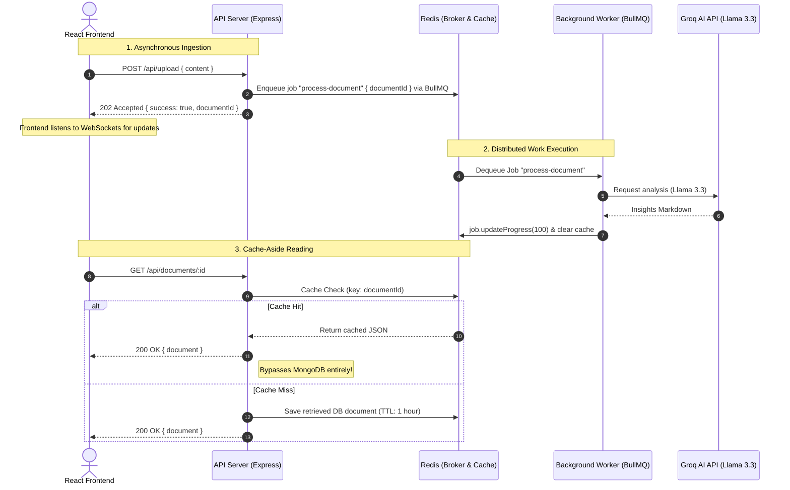

# Redis & BullMQ Architecture in InsightStream

This document explains the role of **Redis** and **BullMQ** in the InsightStream platform. It outlines the specific engineering problems they solve, the architecture of our asynchronous analysis pipeline, and how they interact with other components of the application.

---

## 🚀 Overview

InsightStream is an AI-powered document analysis platform. When a user uploads a document, the system uses large language models (LLMs) via the Groq AI API to extract key insights. 

Because LLM API calls are **computationally expensive, high-latency, and prone to timeouts**, performing this analysis synchronously inside the HTTP request-response cycle would degrade the user experience and crash the server under load.

To solve this, we decoupled our architecture using **Redis** and **BullMQ** to implement:
1. **Asynchronous Task Processing (Job Queues)**
2. **High-Performance Caching**
3. **Real-time Event Streaming**

---

## 🏗️ Architectural Role & Interaction

The diagram below illustrates how Redis and BullMQ coordinate the document analysis flow between the Express API server, the background worker, and the React frontend.

---

## 🛠️ Why We Use Redis & BullMQ

### 1. Offloading Heavy Workloads (Asynchronous Processing)
* **The Problem**: Querying an LLM (Llama-3.3-70b) takes several seconds or even minutes depending on document size. If the API server waited for this response, the client's HTTP connection would time out, and the Node.js event loop would be blocked.
* **The Solution**: When a document is uploaded, the API server saves the document with a `Pending` status, adds a job to the **BullMQ** queue, and immediately returns a `202 Accepted` response. The actual AI query is handled asynchronously by a separate **background worker process** (`documentWorker.js`).

### 2. Reliable Message Brokerage
* **The Problem**: If the background worker restarts, crashes, or gets overloaded, we could lose tracking of which documents need processing.
* **The Solution**: **Redis** acts as the message broker for BullMQ. It keeps track of job states (`active`, `wait`, `completed`, `failed`, `delayed`) in memory. If a worker crashes mid-job, BullMQ automatically retries the job or moves it to a `failed` state without losing client data.

### 3. High-Performance Caching (Cache-Aside Pattern)
* **The Problem**: Querying MongoDB repeatedly for large documents and their generated insights is slow and puts unnecessary read load on the database.
* **The Solution**: **Redis** is used as a fast, in-memory cache:
  * When a user requests a completed document (`GET /api/documents/:id`), the API server checks Redis first.
  * On a **Cache Hit**, the document is returned instantly, bypassing MongoDB.
  * On a **Cache Miss**, the server retrieves it from MongoDB, caches it in Redis with a **1-hour Time-To-Live (TTL)**, and returns it.
  * **Cache Consistency**: The cache is invalidated (`redisClient.del(id)`) whenever a document is modified, deleted, or when the background worker finishes generating new insights.

### 4. Real-time Progress Tracking
* **The Problem**: Since document processing is asynchronous, the user needs to know how far along their job is (e.g., 20%, 70%, 100%).
* **The Solution**: **BullMQ** provides progress update methods (`job.updateProgress(percentage)`). Our API server listens to queue events via `QueueEvents` and broadcasts these status updates in real-time to the frontend over WebSockets (`Socket.io`).

---

## 📂 Key Codebase References

To see how these technologies are implemented in the project, refer to the following files:

* **[queue.js](file:///c:/Users/Lenovo/Desktop/Insight Stream/backend/src/config/queue.js)**: Configures the `IORedis` connection and defines the BullMQ `documentQueue` and `documentQueueEvents`.
* **[documentController.js](file:///c:/Users/Lenovo/Desktop/Insight Stream/backend/src/controllers/documentController.js)**:
  * `uploadDocument` ([Line 35-38](file:///c:/Users/Lenovo/Desktop/Insight Stream/backend/src/controllers/documentController.js#L35-L38)): Produces/adds jobs to the queue.
  * `getDocumentById` ([Line 61-88](file:///c:/Users/Lenovo/Desktop/Insight Stream/backend/src/controllers/documentController.js#L61-L88)): Implements Cache-Aside reads.
  * `deleteDocument` ([Line 148-149](file:///c:/Users/Lenovo/Desktop/Insight Stream/backend/src/controllers/documentController.js#L148-L149)): Invalidates the cache.
* **[documentWorker.js](file:///c:/Users/Lenovo/Desktop/Insight Stream/backend/src/workers/documentWorker.js)**: Integrates the BullMQ `Worker`, updates job progress, calls the Groq AI API, and clears the Redis cache upon completion.
* **[socketListeners.js](file:///c:/Users/Lenovo/Desktop/Insight Stream/backend/src/utils/socketListeners.js)**: Listens to the `QueueEvents` and emits Socket.io progress updates to clients.
