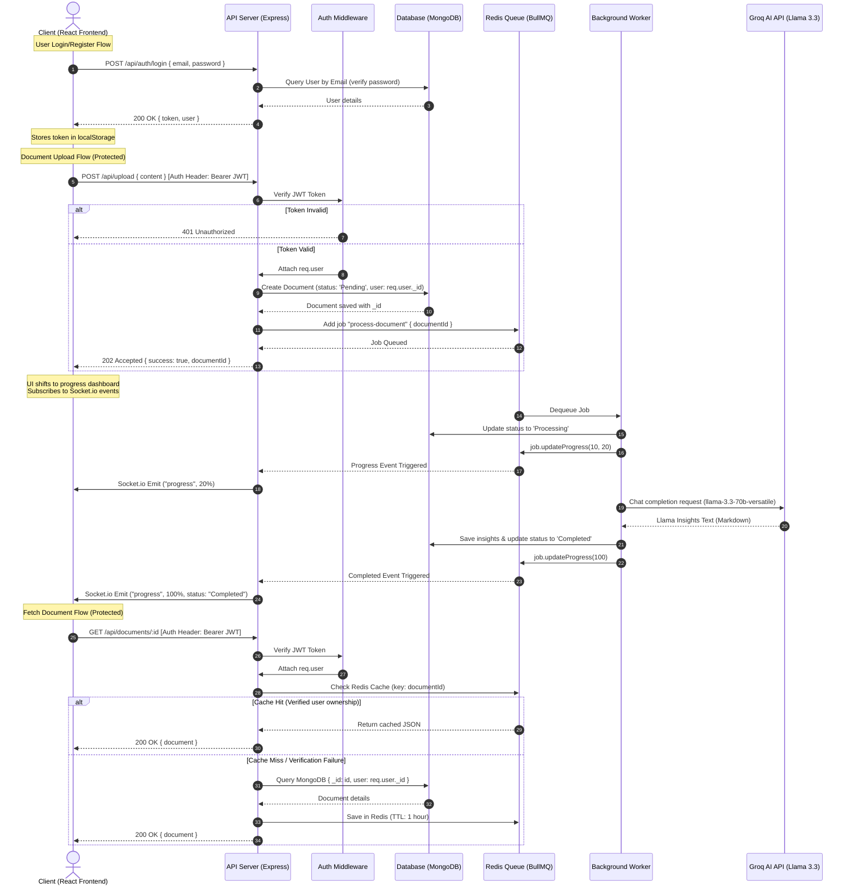

# System Design: InsightStream Asynchronous Analysis Pipeline

This document describes the high-level architecture, design decisions, data flow, database schemas, and state machine of the **InsightStream** document analysis platform.

---

## 🏗️ System Architecture Diagram

The diagram below details the end-to-end communication flow, including JWT authentication, asynchronous job dispatch via BullMQ, real-time status updates via WebSockets, and high-performance caching checks.



---

## 🗄️ Database & Schema Design

InsightStream utilizes MongoDB for persistent storage. Models are defined using Mongoose with timestamps enabled.

### 1. User Schema
Stores details of registered users, with passwords protected using query exclusion rules.
```javascript
const UserSchema = new mongoose.Schema(
  {
    username: {
      type: String,
      required: true,
      unique: true,
      trim: true,
    },
    email: {
      type: String,
      required: true,
      unique: true,
      lowercase: true,
      trim: true,
    },
    password: {
      type: String,
      required: true,
      select: false, // Prevent password from being returned in queries
    },
  },
  {
    timestamps: true, // Creates createdAt and updatedAt fields
  }
);
```

### 2. Document Schema
Links uploaded documents directly to their authenticated author.
```javascript
const DocumentSchema = new mongoose.Schema(
  {
    content: {
      type: String,
      required: true,
    },
    status: {
      type: String,
      enum: ["Pending", "Processing", "Completed", "Failed"],
      default: "Pending",
    },
    insights: {
      type: mongoose.Schema.Types.Mixed, // Stores final generated Markdown insights
    },
    user: {
      type: mongoose.Schema.Types.ObjectId,
      ref: 'User',
      required: true,
    },
    retention: {
      type: String,
      enum: ["24 Hours", "7 Days", "30 Days", "Indefinite"],
      default: "Indefinite"
    },
    expiresAt: {
      type: Date
    }
  },
  {
    timestamps: true, // Creates createdAt and updatedAt fields
  }
);

DocumentSchema.index({ expiresAt: 1 }, { expireAfterSeconds: 0 });
```

---

## 🚦 Pipeline State Machine

A document transitions through the following statuses during processing:

1. **Pending**: Initial state when the document is created. A BullMQ job containing `{ documentId }` is enqueued in Redis.
2. **Processing**: The document worker picks up the job, sets MongoDB status to `Processing`, and triggers a 20% progress update. It then queries the Groq API.
3. **Completed**: Llama 3.3 returns generated insights. The worker saves the insights, updates MongoDB status to `Completed`, clears the Redis cache for this document, and triggers a 100% progress update.
4. **Failed**: An error occurs during worker execution or AI API connection. The database status is updated to `Failed`, and the cache is cleared to prevent returning stale, pending entries.

---

## 📡 Live Event & Socket Orchestration

* **Queue Dispatch**: The Express controller inserts jobs into the `"document-queue"` queue backed by Redis via BullMQ.
* **Worker Execution**: The background worker process (`documentWorker.js`) subscribes to the queue, executing jobs sequentially or in parallel. It updates job progress using `job.updateProgress(percentage)`.
* **Centralized Dispatcher**: The main server connects a `QueueEvents` listener to the queue:
  - **Progress Event**: When `job.updateProgress()` is fired, the server fetches the job object, maps the `jobId` to the matching `documentId`, and emits a WebSocket payload: `io.emit("progress", { documentId, progress })`.
  - **Completed Event**: When the worker returns successfully, the server broadcasts: `io.emit("progress", { documentId, progress: 100, status: "Completed" })`.
* **Client Listening**: The frontend listens for `"progress"` socket broadcasts, syncing progress percentages dynamically. When the job hits 100%, the frontend requests the document insights via the REST API.

---

## 💾 Caching Strategy (Redis)

To ensure secure, low-latency lookups, the system implements a secure **Cache-Aside Pattern** with tenant isolation:
1. When a client requests `GET /api/documents/:id`, the route validates the user's JWT.
2. The server queries Redis using `id` as the key.
3. **Cache Hit**:
   - The JSON string is parsed.
   - The server verifies that the document owner matches the current user: `parsedDoc.user === req.user._id`.
   - If verified, the parsed object is returned immediately.
   - If verification fails, it falls back to MongoDB (or returns unauthorized).
4. **Cache Miss**:
   - The server queries MongoDB: `Document.findOne({ _id: id, user: req.user._id })`.
   - If the document is found and has reached a terminal state (`Completed` or `Failed`), it is serialized and cached in Redis with a **1-hour Time-To-Live (TTL)**.
   - The document is returned to the client.

---

## 🧹 Data Retention & Expiry Policy

To respect user data privacy and optimize server storage, the system implements a configurable data retention policy:

1. **Policy Configuration**:
   - The user selects a retention period in the UI settings (stored in local storage as `setting-retention`).
   - Options include: `24 Hours`, `7 Days`, `30 Days`, and `Indefinite`.

2. **Ingestion & Expiration Calculation**:
   - During `POST /api/upload`, the selected policy is sent to the backend.
   - The server calculates an `expiresAt` date:
     - `24 Hours`: `now + 24 hours`
     - `7 Days`: `now + 7 days`
     - `30 Days`: `now + 30 days`
     - `Indefinite`: `null` (never expires)
   - These values are stored in the MongoDB Document record.

3. **Automatic Cleanup (MongoDB TTL)**:
   - MongoDB native TTL index deletes documents when the current time passes the date stored in `expiresAt`:
     ```javascript
     DocumentSchema.index({ expiresAt: 1 }, { expireAfterSeconds: 0 });
     ```
   - MongoDB background threads run approximately every 60 seconds to clean up expired documents, guaranteeing eventual consistency of deletions.

---

## 🎨 Premium Visual Branding & Theme System

To create a premium enterprise experience, the user interface integrates a custom branding identity, isolated routing, and dynamic theme overrides:

### 1. Isolated Landing Page Entrypoint
* **Unauthenticated Routing**: Directs users visiting the root path `/` to an isolated `<LandingPage />` container if they are unauthenticated.
* **Race Condition Protection**: A top-level boot loader in `App.jsx` delays render calculations until authentication credentials (stored locally) have been fully parsed. This prevents redirects or flashing headers on startup.
* **Premium Animations**: Integrates a custom GSAP timeline for text reveals on boot, scroll triggers, and Framer Motion spring curves for local UI widgets, card highlights, and FAQ accordions.

### 2. Custom Geometric Vector Logo
* **Visual Concept**: The logo features twin overlapping high-speed streams (representing data pipelines and continuous queue throughput) orbiting a central geometric sparkle core (representing AI value extraction and insights).
* **Theme-Driven Gradients**: The SVG gradients are bound to the CSS variables `--logo-grad-start` and `--logo-grad-end`. This allows the logo color palette to transform dynamically in real-time when the active theme is changed (Purple/Indigo in Dark mode, Indigo/Cyan in Light mode, Neon Green/Blue in Cyberpunk).

### 3. Public Route Theme Enforcement
* **Landing Page Locks**: The `.landing-theme` class in `index.css` overrides the gradient variables to guarantee that the logo is always rendered in its signature purple/indigo style on the landing page, regardless of past user sessions.
* **Public Page Locking**: Forces the default `dark` theme on all unauthenticated routes (including `/login` and `/register`) for design consistency. The custom user-selected preferences are loaded only after authentication succeeds.

---

## 🔔 Dynamic Notification Settings Engine

Wired up and activated the previously static System Preferences toggles to interactively affect client behavior during the document analysis lifecycle:

1. **Email Alerts (Simulation)**:
   * When enabled (`setting-email-alerts` is `true`), document analysis completion triggers a secondary mock alert informatively logs: `[Email Alert] Digest report sent to user@example.com`.

2. **Browser Toast Notifications**:
   * Standard and progress toasts are bound to the `setting-browser-alerts` value. When disabled, all background worker completion and upload registration toasts are suppressed, allowing for silent background runs.

3. **Auditory Alerts (Web Audio Synthesizer)**:
   * Playback is bound to the `setting-audio-alerts` setting.
   * Utilizes a zero-dependency programmatic helper (`playChime`) that connects a browser Web Audio `AudioContext` to dual sine/triangle oscillators. It generates a custom double-note chime (D5 to A5) on success, and a warning sawtooth frequency on failure.
