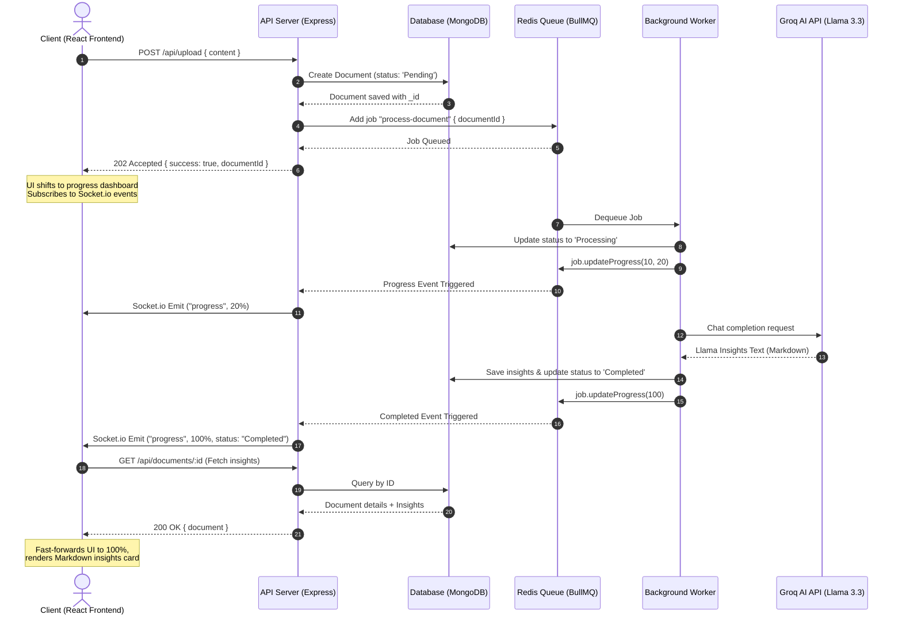

# System Design: InsightStream Asynchronous Analysis Pipeline

This document describes the high-level architecture, design decisions, data flow, and state machine of the **InsightStream** document analysis platform.

---

## 🏗️ System Architecture Diagram



---

## 🗄️ Database & Schema Design

InsightStream utilizes MongoDB for persistence of text inputs and AI outputs.

### Document Schema
```javascript
const DocumentSchema = new mongoose.Schema({
  content: {
    type: String,
    required: true,
  },
  insights: {
    type: String, // Stores final generated Markdown insights
    default: null,
  },
  status: {
    type: String,
    enum: ['Pending', 'Processing', 'Completed', 'Failed'],
    default: 'Pending',
  },
  createdAt: {
    type: Date,
    default: Date.now,
  }
});
```

---

## 🚦 Pipeline State Machine

A document progresses through the following states in the database:

1. **Pending**: The document has been uploaded to the Express API and a job has been registered in the BullMQ queue.
2. **Processing**: The background worker has picked up the job and is querying the Groq Cloud API using the Llama-3.3-70b model.
3. **Completed**: Groq returned the insights successfully, and the worker saved the insights and updated the status.
4. **Failed**: An error occurred in the queue or during the AI generation. The database is updated defensively so that the client receives feedback.

---

## 📡 Live Event & Socket Orchestration

* **Producer**: The Express API pushes a job structure containing `{ documentId }` into the `"document-queue"` Redis database.
* **Consumer**: The `documentWorker.js` process acts as a BullMQ worker executing the analysis logic. It notifies the queue of its progress using `job.updateProgress(value)`.
* **Broker**: The Express server listens to the queue's internal events using `QueueEvents` (`progress` and `completed` listeners) and broadcasts them instantly to all socket connections.
* **Client**: The frontend listens for `"progress"` events. When the target `documentId` receives a 100% or Completed status, the client fetches the document details and transitions from the loading skeleton into the markdown-rendered results card.

---

## 💾 Caching Strategy (Redis)

To minimize database lookups and speed up response times for frequently accessed documents, the platform employs a **Cache-Aside pattern** using Redis:
1. When a client requests insights via `GET /api/documents/:id`, the API server checks Redis.
2. **Cache Hit**: If present, the stringified document is parsed and returned instantly, skipping the MongoDB query.
3. **Cache Miss**: If absent, the document is fetched from MongoDB, cached in Redis with a **1-hour Time-To-Live (TTL)** (`set(id, data, "EX", 3600)`), and then returned.
